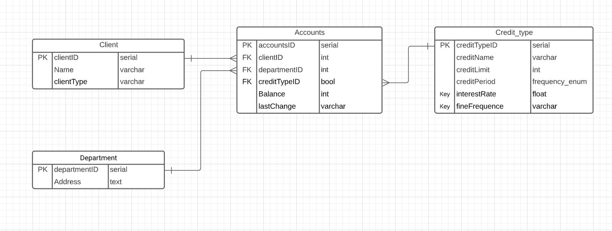
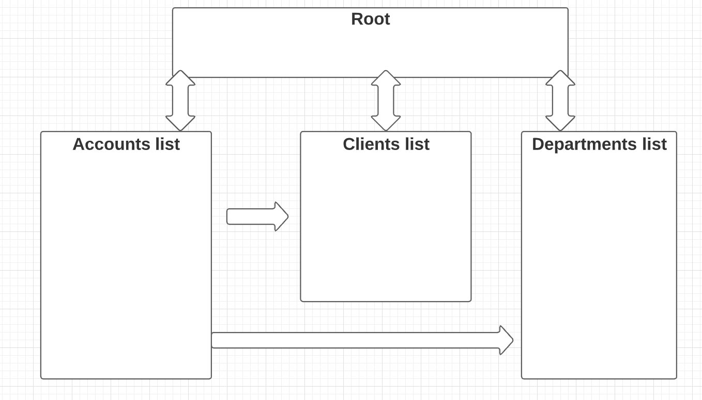
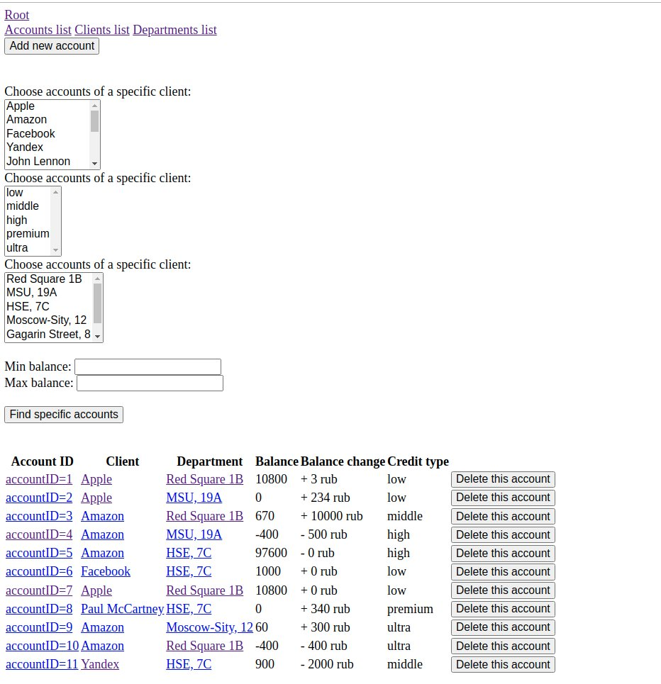
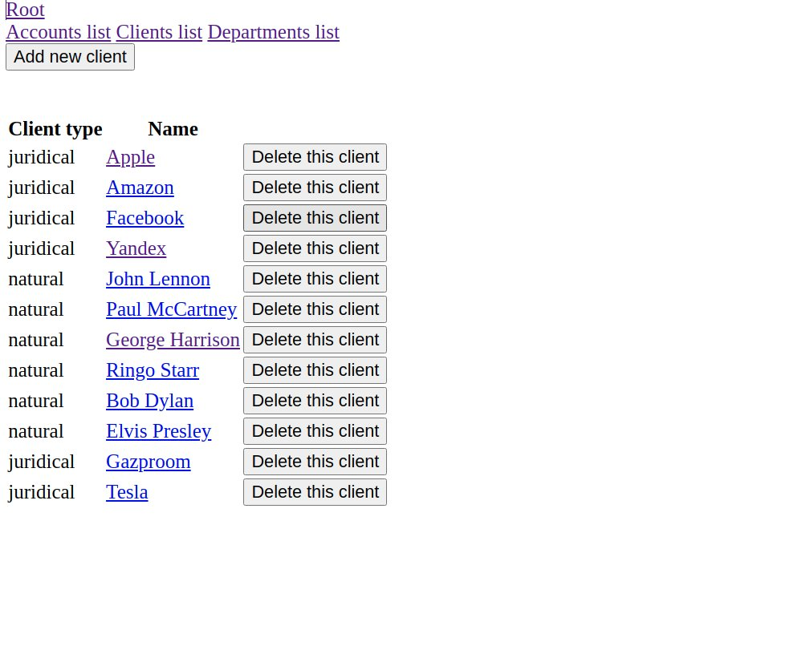
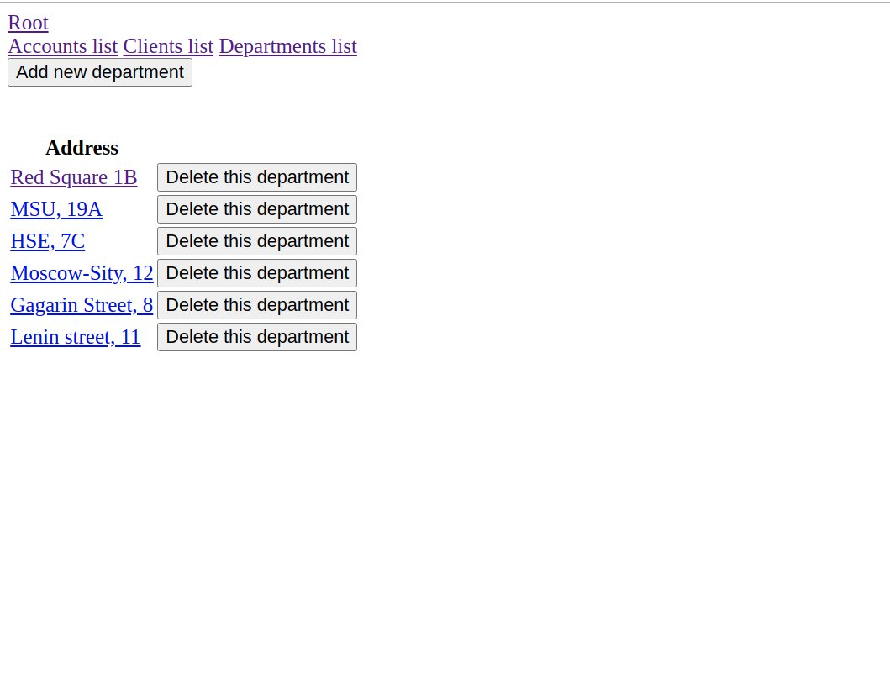

# Практикум по Web-технологиям
# ВМК МГУ 3 курс весенний семестр 2021
## Система информации о счетах клиентов банка
### Описание задачи
Разработать и реализовать небольшое Web-приложение, предназначенное для хранения и систематизации аккаунтов в банке.

### Схема базы данных приложения

### Подготовка Базы Данных
Запустить скрипты из папки SQLScripts
Для юнит-тестирования не надо запускать fillTables.sql

### Описание и навигация между страницами
Стартовая страница содержит ссылки на 3 страницы и ссылка-возвращение на стартовую страницу.

### Схема взаимодействия страниц

### Описание функциональности страниц

При нажатии на **Accounts_list** переходим на страницу аккаунтов.

Функционал **Accounts_list** таков.  
Есть возможность добавить новый счёт кнопкой **Add new account**.и  вывести список счётов по различным фильтрам.  
Для вывода списка счетов надо выбрать категорию для фильтра из списка и выбрать из списка нужное значение. (тип кредитной ставки, клиент, отделение).
Также можно отбирать клиентов чей баланс не больше, или не меньше некого значения.
После выбора нужных параметров список появляется внизу экрана после нажатия на кнопку **Find specific account**.  
Около списка есть возможность удалить счёт кнопкой **Delete account**.  
Если кликнуть на счёт, то выйдет подробная информация о счете и будет возможность поменять баланс.
При этом происходит проверка, что баланс находится в пределах допустимого кредитным типом.  
Если кликнуть на клиента,то выйдет страница соответствующего клиента. Аналогично с отделением.

При нажатии на **Clients_list** переходим на страницу клиентов.  

Функционал **Clients_list** таков.  
Выходит список всех клиентов.  
Есть возможность добавить нового клиента. Кнопка **Add new client**.  
Около списка есть возможность удалить клиента кнопкой **Delete client**. 
При этом происходит проверка, что у клиента нет счетов, иначе выходит сообщение, что нельзя удалить клиента.  
Если кликнуть на клиента, то выйдет подробная информация и можно будет ее поменять.

При нажатии на **Departments_list** переходим на страницу отделений.  

Функционал **Departments_list** таков.  
Выходит список всех отделений.  
Есть возможность добавить новое отделение. Кнопка **Add new department**.  
Около списка есть возможность удалить отделение кнопкой **Delete department**.
При этом происходит проверка, что у отделения нет счетов, иначе выходит сообщение, что нельзя удалить отделение.
Если кликнуть на отделение, то выйдет подробная информация и можно будет ее поменять.

### Сценарии использования

1) Открытие счета для нового клиента.  
**Root** -> **Clients_list** -> **Add new client** (создали клиента) -> **Root** -> **Accounts_list** -> **Add new account** (выбирается клиент, тип кредитной ставки, департамент и стартовый баланс.

2) Вывод списка всех счетов, которые имеют положительный баланс.   
**Root** -> **Clients_list** (выбираем Min balance 0) -> **Find specific accounts** (получили нужный список)

3) Уменьшение баланса счёта (может не получится).  
**Root** -> **Accounts_list** -> (выбираем нужный счёт и вводим сумму) -> **Sumbit** (либо поменяется баланс счёта, либо выйдет, что операция не прошла, так как баланс станет меньше чем лимит кредитования.

4) Удаление отделения (может не получится).  
**Root** -> **Departments_list** -> **Delete department** (около нужного отделения).
Возможно, что удалить не получится, выйдет сообщение про ошибку, если есть счета этого отделения.

5) Удаление отделения (безопасный вариант).  
**Root** -> **Accounts_list** (выбираем нужное отделение) -> **Find specific accounts** -> (получили список аккаунтов, которые относятся к этому отделению, еслли список не пуст, то удаляем все, используя **Delete account**) -> **Root** -> **Departments_list** -> **Delete department** (около нужного отделения).
